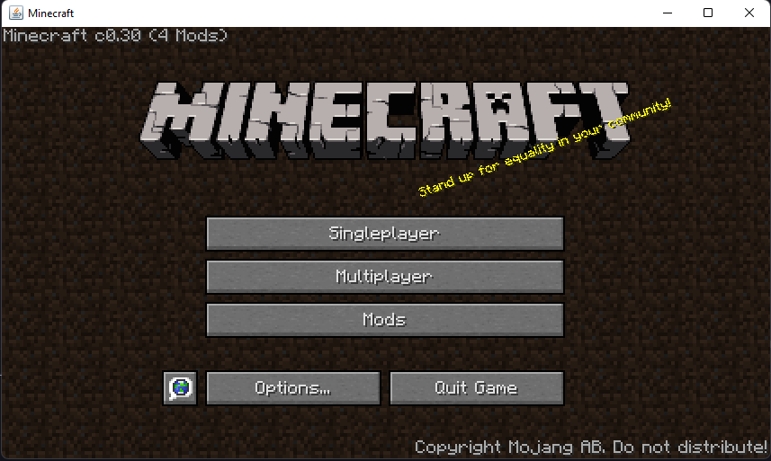
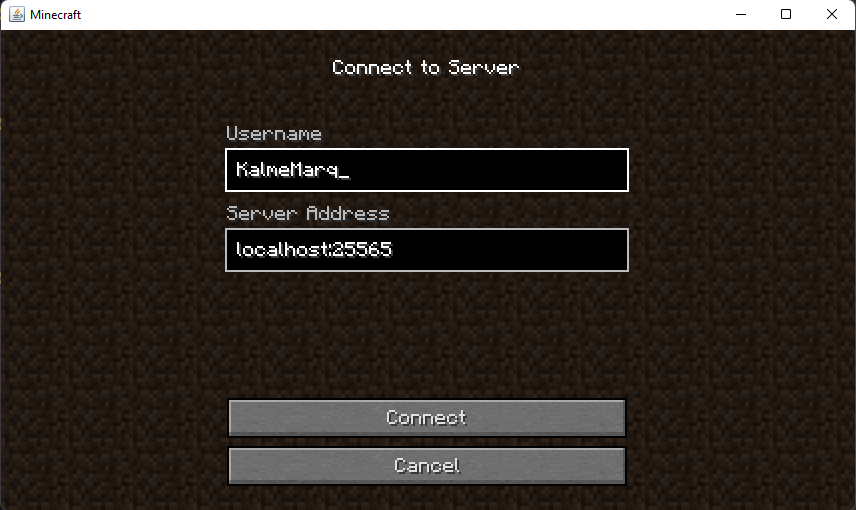
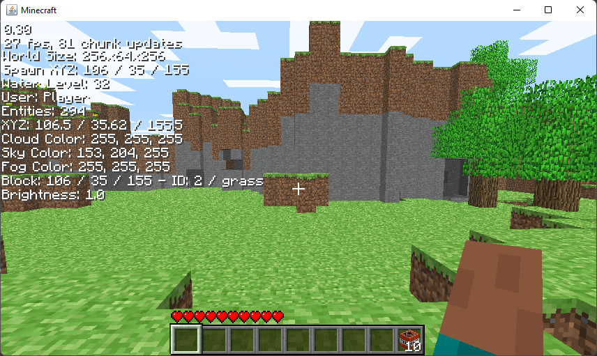
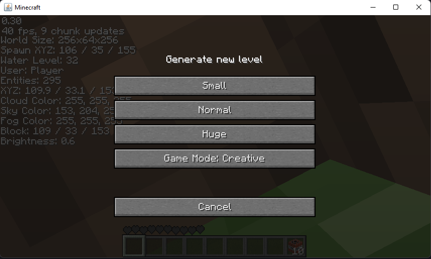

# KM LegacyGUI Mod (Fabric Minecraft Classic 0.30)

### Features
- All screens have been reworked to resemble more recent versions
- Translations
- F3 menu
- F1 hide hud
- Changed the lighting direction of the items in the hud and added selected item name.
- Title screen
  - Splashes
  - Chance of the old cobblestone logo (1/17) or the minceraft logo (1/11) to appear
- Multiplayer screen
- Servers is accessible through the "Multiplayer" button in the TitleScreen

